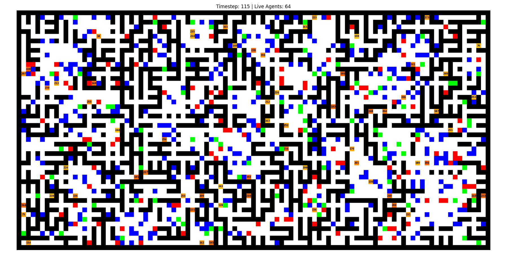

# **Experiment: The Homeostatic Imperative in Embodied Intelligence - A Pain Signal Hypothesis**

**Objective:**

To demonstrate that a population of embodied agents, guided by a combination of an evolutionary survival-of-the-fittest mechanism and an intrinsic pain signal, can develop strategies to survive and adapt in a complex, hazardous environment without explicit, externally defined rewards.

**Hypothesis:**

A population of agents whose primary evolutionary pressure is survival time (longevity) will produce individuals that learn to minimize an internal "pain signal" derived from low energy and high-effort situations. This will lead to the emergence of complex behaviors such as exploration for resources (power cells), avoidance of hazards (traps, wind), and efficient movement.

**Algorithm:**

**I. Environment Setup:**

1.  **Grid World:**
    *   **Grid Size:** 101 x 101 (include edge walls).
    *   **Procedural Generation:** The map is generated using a `MazeMapGenerator` which combines Prim's algorithm for maze creation with the addition of multiple rooms to create a complex, non-uniform space.
    *   **Tile Types:**
        *   **Wall** (Black): Impassable.
        *   **Floor** (White): Walkable, neutral.
        *   **Trap** (Red): Agent dies instantly upon entering.
        *   **Wind** (Blue): Increases energy cost for movement and staying.
    *   **Agent Spawning:** Agents spawn at random, valid "Floor" tile locations.

2.  **Power Cell Dynamics:**
    *   A fixed number of power cells (e.g., 256) are spawned at random "Floor" locations at the start and periodically during the simulation (e.g., 5% chance each timestep to respawn all cells).
    *   When a power cell is collected, it provides a fixed amount of energy (e.g., 25) and is consumed (the tile turns to "Floor").

**II. Agent Setup:**

1.  **Architecture (`AgentModel`):**
    *   **Encoder:** A simple CNN (2 `Conv2d` layers) that processes the `9x9` local visual perception of the agent and encodes it into a feature vector.
    *   **Memory Processor (`ConvModel`):** A custom convolutional model using `LFM2ConvOperator` and `SwiGLU` blocks. It processes the sequence of the agent's last 31 actions.
    *   **Integration:** The encoded perception vector is concatenated with the action history embeddings before being processed by the `ConvModel` to decide the next action.
    *   **Decoder:** A simple deconvolutional network (`ConvTranspose2d`) that attempts to predict the agent's next `9x9` perception based on its internal state.
    *   **Action Head (`lm_head`):** A linear layer that produces logits for the 5 possible actions from the `ConvModel`'s output.

2.  **Parameters:**
    *   `perception_size`: Fixed at 9x9.
    *   `memory_length`: Fixed at 63 previous actions.
    *   Actions: 5 (up, down, left, right, idle).
    *   Learning Rate: 1e-4 (using AdamW optimizer).

3.  **Internal State & Pain Signal:**
    *   **Energy Level:** Initialized to 100. Decreases with each step, with extra penalties for being in "Wind" tiles. Increases when a power cell is collected. Agent dies if energy reaches 0.
    *   **Pain Signal:** Calculated each step as a weighted sum of two components:
        *   **Energy Pain (`pain_energy`):** Inverse of energy level. High pain when energy is low.
        *   **Computational/Effort Pain (`pain_comp`):** An implicit measure of effort. High cost for being in a "Wind" tile, medium cost for moving, and low cost for idling.
    *   **Uncertainty:** While not part of the pain signal, it is calculated as the prediction error between the Decoder's output and the actual next perception. This is used as a loss for training the world model (Encoder/Decoder).

**III. Learning and Evolution Process:**

The simulation employs a two-tiered learning strategy: a primary evolutionary mechanism for inter-generational learning and a secondary (currently disabled) mechanism for intra-life learning.

1.  **Main Loop (Evolutionary Selection):**
    *   **a. Action:** Each agent perceives its local `9x9` environment, processes it with its action history, and chooses an action using an epsilon-greedy policy (10% random action).
    *   **b. Interaction:** The agent executes the action. Its energy is updated based on the tile it lands on (Wind, Power Cell) and the base cost of survival.
    *   **c. Survival Check:** The agent's life state is checked.
        *   **Death:** An agent dies if it enters a "Trap" tile or its energy level drops to zero.
        *   **Survival:** If the agent survives, its `age` is incremented.
    *   **d. Reproduction (Genetic Algorithm):**
        *   When an agent dies, it is removed from the simulation.
        *   A new agent is immediately spawned to maintain the population size.
        *   The new agent is an "offspring" of from the **Tournament Selection** (choose 3 random survivor and pick agent with the highest `age`).
        *   The offspring inherits the parent's model weights, with a small amount of Gaussian noise added for **mutation**. This ensures that successful survival strategies are passed on and explored further.

2.  **Intra-Life Learning (Unstable):**
    *   The `agent.learn` method is designed to allow agents to learn within their own lifetime but is currently unstable.
    *   **If enabled, it would work as follows:**
        *   **Uncertainty Loss:** The Encoder/Decoder part of the model would be trained via supervised learning to minimize the prediction error between the predicted next perception and the actual next perception. This encourages the agent to build an accurate internal world model.
        *   **Action Loss:** The action-selection part of the model would be trained via reinforcement learning. The reward signal is derived from the **change in pain**. An action is "good" if it leads to a decrease in the pain signal (`pain_delta < 0`). The cross-entropy loss for the chosen action is weighted by this condition, only applying gradients for actions that reduce pain.

**IV. Evaluation:**

1.  **Metrics:**
    *   **Maximum Survival Time (Age):** The primary metric. Tracks the age of the oldest living agent and the oldest agent ever recorded. This directly measures the success of the evolutionary strategy.
    *   **Average Population Age:** Indicates the overall fitness and resilience of the current population.
    *   **Number of Live Agents:** Tracks population stability.
    *   **Analysis of Survivor Traits:** Post-simulation analysis of the behavior of long-lived agents to identify emergent strategies (e.g., pathing, risk-aversion, resource-seeking).

2.  **Analysis:**
    *   Analyze the correlation between survival time and the learned behaviors.
    *   Investigate if agents evolve to effectively balance exploration (to find power cells and reduce uncertainty) with exploitation (staying in safe, low-energy-cost areas).
    *   Compare the performance of populations evolved with different pain signal weights or mutation rates.

**V. Visualization:**

1.  **Real-time (via Matplotlib/Pygame - requires update):**
    *   Display the grid world, showing Walls, Traps, Wind, and Power Cells.
    *   Show each agent's position, represented by a unique color.
    *   Display agent IDs and key stats (e.g., energy level) as text overlays.
    *   Provide a title with the current timestep and the number of live agents.
    *   *Note: The animation code in `simulation.py` is outdated and needs to be updated to work with the current dictionary-based agent management system.*

2.  **Post-Simulation (using Matplotlib):**
    *   Plot the maximum and average agent age over time to visualize the progress of evolution.
    *   Create heatmaps of agent visitations to identify common pathways and areas of exploration vs. avoidance.